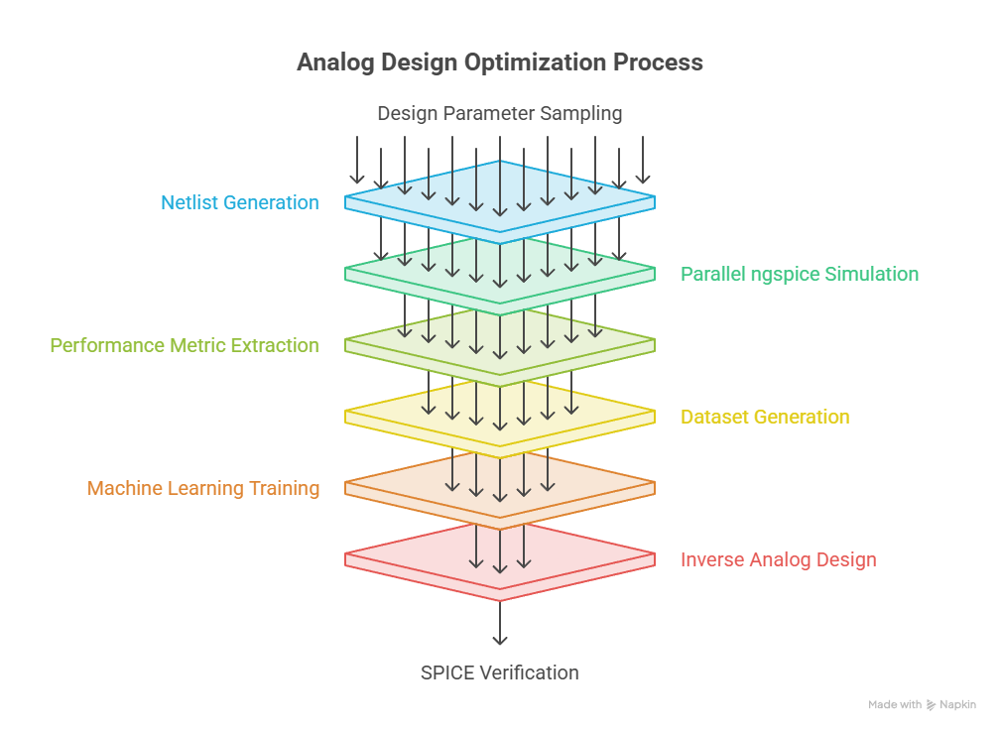
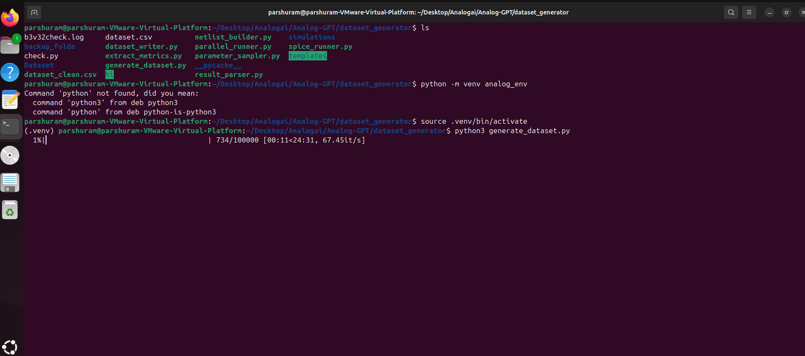
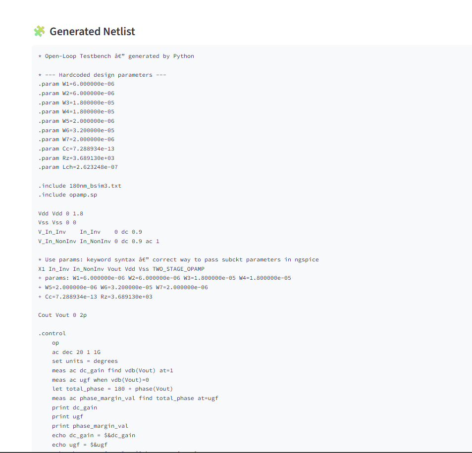
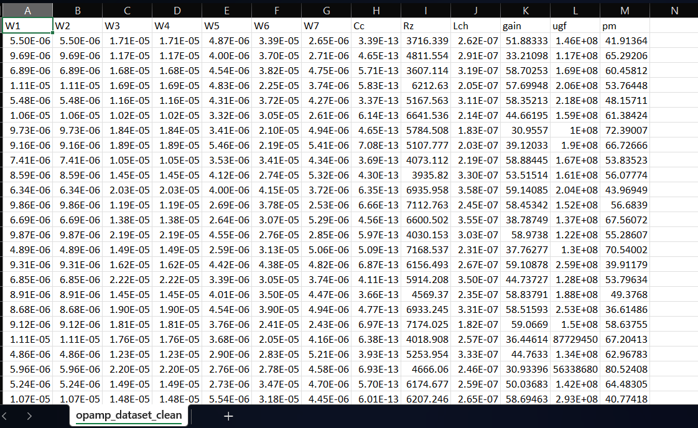
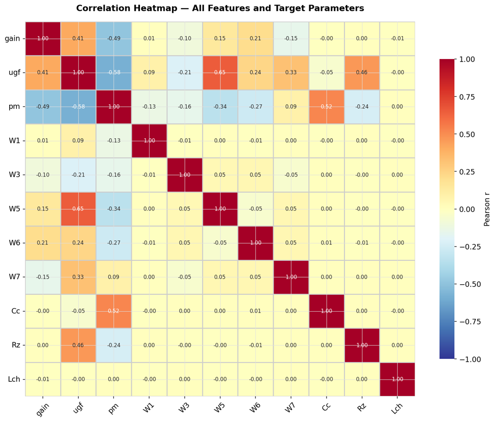
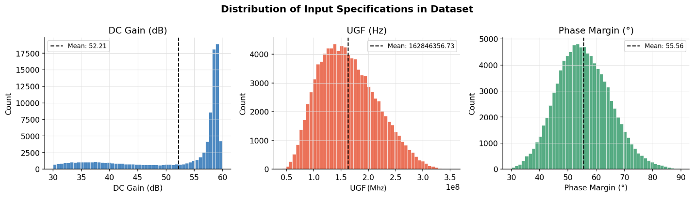
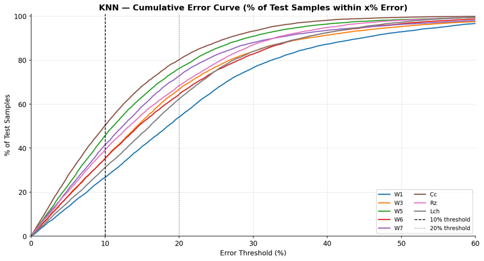
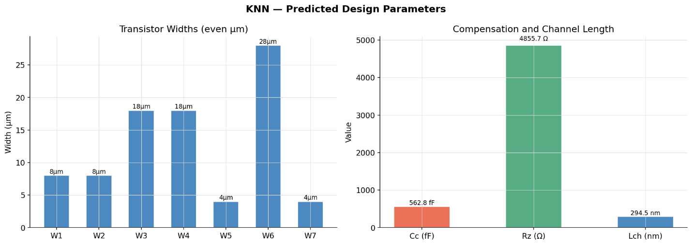
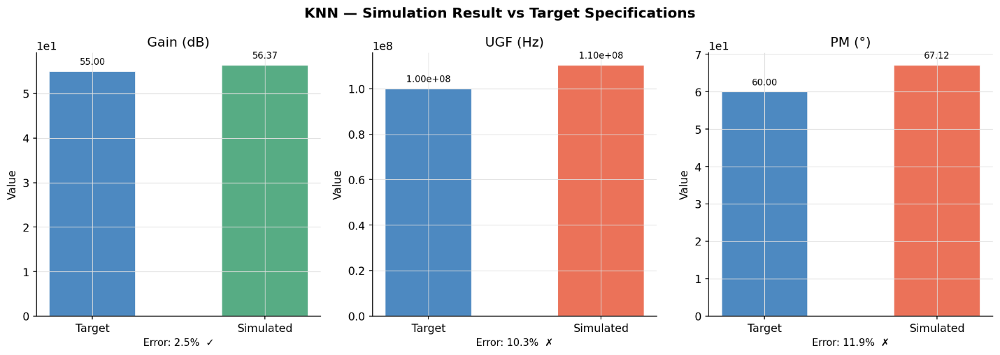
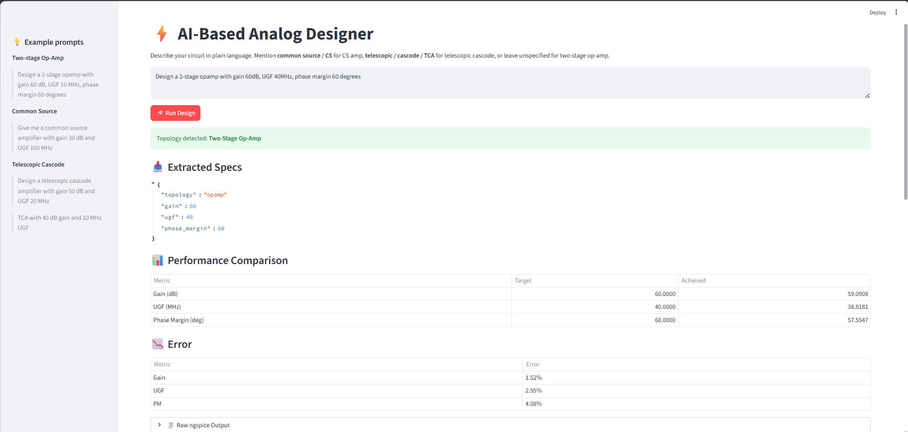

# AnalogGPT: AI-Assisted Analog IC Design using SPICE & Machine Learning

<p align="center">
  <b>Automated Dataset Generation • Parallel ngspice Simulation • Machine Learning • Inverse Analog Design • SPICE Verification</b>
</p>
# 🎥 Project Demo

<p align="center">
  <a href="images/analogAi.mp4">
      
  </a>
</p>

<p align="center">
<b>Click the thumbnail to watch the complete demonstration.</b>
</p>
<p align="center">
  
  
  
  
  
  
  
</p>

<p align="center">
  
</p>


---

## Project Overview

Analog Integrated Circuit (IC) design remains one of the most time-consuming and manual phases of modern semiconductor product development. While digital IC design benefits from highly automated synthesis and physical design flows, analog circuit sizing continues to rely heavily on expert intuition, manual calculations, and iterative SPICE simulations. 

### The Bottleneck in Analog CAD
* **High-Dimensional Design Space:** Even a simple two-stage operational amplifier features multiple design variables (transistor widths, lengths, bias currents, compensation capacitors, nulling resistors) that exhibit highly non-linear interactions.
* **Expensive SPICE Simulations:** High-fidelity SPICE simulation (e.g., `ngspice`, `Spectre`) is the industry standard for verification, but running thousands of simulations to explore the design space is computationally prohibitive.
* **Manual Iteration Loops:** Designing an analog circuit to meet strict target specifications (e.g., DC Gain, Unity-Gain Frequency, and Phase Margin) requires constant, manual tweaking of transistor sizes, which slows down Time-to-Market (TTM).

### The Machine Learning Paradigm
AnalogGPT addresses these limitations by introducing a machine learning framework that builds high-accuracy **surrogate models** of analog circuits. By treating the SPICE simulator as a ground-truth label generator, we train ML models to map physical dimensions directly to performance metrics (Forward Prediction) and invert the relationship to predict device sizes from target specs (Inverse Analog Design). 

This repository implements the end-to-end flow: from automated parallel SPICE dataset generation to machine learning training, neural-network-driven inverse sizing, and closed-loop SPICE verification.

---

## Key Features

* ✔ **Automated Parameter Sampling:** Multi-dimensional parameter perturbations of device dimensions and passive values.
* ✔ **Dynamic SPICE Netlist Generation:** Programmatic template compilation injecting variables into spice files.
* ✔ **Parallel ngspice Execution:** High-efficiency multiprocessing engine managing batch simulation runs.
* ✔ **Automatic Metric Extraction:** Regex-driven parser to extract AC gain, unity-gain frequency (UGF), and phase margin.
* ✔ **Dataset Cleaning:** Automated filtering of duplicate trials, non-convergent solutions, and non-functional circuit points.
* ✔ **Machine Learning Surrogate Models:** Forward prediction comparison across XGBoost, Random Forest, Gradient Boosting, KNN, and MLPs.
* ✔ **Inverse Analog Design:** Neural-network-driven sizing generation matching input specification targets.
* ✔ **SPICE Verification:** Closed-loop system that simulates the predicted circuit sizes to verify target metrics.
* ✔ **Modular Python Framework:** Extensible, object-oriented design facilitating custom circuit templates and technology nodes.

---

## AI-Assisted Analog Design Pipeline

The repository implements a structured, multi-stage pipeline designed to bridge the gap between traditional circuit simulation and modern machine learning frameworks. The complete project flow is mapped out below:

```
      Parameter Sampling
              ↓
      Netlist Generation
              ↓
 Parallel ngspice Simulation
              ↓
    Performance Extraction
              ↓
      Dataset Generation
              ↓
       Machine Learning
              ↓
    Inverse Analog Design
              ↓
      SPICE Verification
```

1. **Parameter Sampling:** Device dimensions (widths, channel lengths) and compensation components (capacitors, resistors) are sampled dynamically.
2. **Netlist Generation:** The parameters are written into templated `.sp` files.
3. **Parallel ngspice Simulation:** Simulations run in parallel across CPU cores using subprocess scheduling.
4. **Performance Extraction:** Key metrics (Gain, UGF, PM) are parsed directly from ngspice output streams.
5. **Dataset Generation:** Data is filtered for physical feasibility and stored in highly structured CSV formats.
6. **Machine Learning:** Forward surrogate models learn mapping $X \rightarrow Y$ and compare regressor performances.
7. **Inverse Analog Design:** A Multi-Layer Perceptron (MLP) acts as an inverse solver mapping $Y \rightarrow X$.
8. **SPICE Verification:** Predictions are re-simulated in ngspice to verify actual circuit performance.

---

## Repository Structure

The project directory is structured as follows:

*   **`Dataset/`**: Directory containing the generated CSV data files.
    *   [dataset.csv](file:///c:/Users/HP/Desktop/dataset_generator_good/dataset_generator/Dataset/dataset.csv): The raw simulation output containing parameter configurations and extracted circuit metrics.
    *   [dataset_clean.csv](file:///c:/Users/HP/Desktop/dataset_generator_good/dataset_generator/Dataset/dataset_clean.csv): The processed, cleaned, and filtered dataset optimized for machine learning.
*   **`templates/`**: Holds PDK definitions and SPICE netlist structures.
    *   [180nm_bsim3.txt](file:///c:/Users/HP/Desktop/dataset_generator_good/dataset_generator/templates/180nm_bsim3.txt): BSIM3v3 model files for the 180nm CMOS technology node.
    *   [opamp.sp](file:///c:/Users/HP/Desktop/dataset_generator_good/dataset_generator/templates/opamp.sp): The subcircuit netlist definition of the parameterized two-stage Miller operational amplifier.
    *   [tb_openloop.sp](file:///c:/Users/HP/Desktop/dataset_generator_good/dataset_generator/templates/tb_openloop.sp): Testbench configuration file for open-loop AC analysis.
*   **`images/`**: Contains visual documentation and diagrams.
    *   `pipeline.png`: Overview diagram of the end-to-end AI-assisted CAD pipeline.
    *   `generation_progress.png`: Terminal CLI screenshot showing the parallel dataset generation.
    *   `dataset_sample.png`: Spreadsheet view of the cleaned dataset.
    *   `generated_netlist.png`: Automatically generated parameterized SPICE netlist with design variables.
    *   `analog_designer_ui.png`: Graphical UI dashboard showing comparison and prediction results.
    *   `correlation_heatmap.png`: Pearson correlation matrix heatmap.
    *   `dataset_distribution.png`: Graphical distribution plots of DC Gain, UGF, and Phase Margin.
    *   `error_curve.png`: Cumulative error curves for predicted parameters.
    *   `predicted_parameters.png`: Sizing bar chart for transistor widths and compensation passives.
    *   `verification_results.png`: Bar chart comparison between simulated and target specifications.
*   **`simulations/`**: Temporary scratch directory generated at runtime to store transient simulation files.
*   **`parameter_sampler.py`**: Samples randomized configurations using uniform and log-uniform distributions.
*   **`netlist_builder.py`**: Replaces netlist variables with physical dimensions and generates `.sp` output.
*   **`spice_runner.py`**: Invokes `ngspice` in batch mode and captures command-line outputs.
*   **`extract_metrics.py`**: Parses measurement statements and frequency responses.
*   **`result_parser.py`**: Validates simulated outputs and filters out non-converging operating points.
*   **`dataset_writer.py`**: Safely manages database outputs using process-safe queues.
*   **`parallel_runner.py`**: Controls execution pool and worker scaling.
*   **`generate_dataset.py`**: Main control program to run the simulation sweep.
*   **`check.py`**: Runs statistics profiling, distributions, and correlation maps on the dataset.

---

## Installation

### 1. Clone the Repository
```bash
git clone https://github.com/username/AnalogGPT.git
cd AnalogGPT
```

### 2. Setup Python Environment
Create a virtual environment and install dependency libraries:
```bash
python -m venv .venv
source .venv/bin/activate  # On Windows: .venv\Scripts\activate
pip install --upgrade pip
pip install -r requirements.txt
```

*Note: Ensure your `requirements.txt` includes: `numpy`, `pandas`, `scipy`, `scikit-learn`, `xgboost`, `matplotlib`, `seaborn`, and `tqdm`.*

### 3. Install ngspice
The simulation pipeline requires `ngspice` to be installed and available in the system execution path (`PATH`).

#### Linux (Ubuntu/Debian)
```bash
sudo apt-get update
sudo apt-get install -y ngspice
```

#### macOS (using Homebrew)
```bash
brew install ngspice
```

#### Windows
1. Download the latest release from the [ngspice SourceForge Page](https://sourceforge.net/projects/ngspice/).
2. Extract the folder (e.g., to `C:\ngspice`).
3. Add the `C:\ngspice\bin` directory to your System **Environment Variables** under `PATH`.
4. Verify installation by typing `ngspice --version` in your Command Prompt/PowerShell.

---

## Quick Start

### Step 1: Execute Parallel Dataset Generation
Generate 100,000 simulations using all available CPU threads:
```bash
python generate_dataset.py
```
This script will sample sizing parameters, write netlists, invoke ngspice in parallel, extract metrics, and perform threshold-based data cleaning.

### Step 2: Analyze Data Distributions
Run exploratory data analysis (EDA) to verify features:
```bash
python check.py
```
This generates statistics and launches the correlation analysis heatmap.

### Step 3: Train Machine Learning Surrogates
Run training scripts to fit regressors (XGBoost, MLP, Random Forest):
```bash
python train.py
```

### Step 4: Perform Inverse Sizing & SPICE Verification
Solve for target specifications and run closed-loop verification:
```bash
python verify.py --gain 55 --ugf 150e6 --pm 60
```

---

## Dataset Generation

The dataset generation engine handles the automation flow using modular components:

```
┌──────────────────┐      ┌─────────────────┐      ┌────────────────┐
│ ParameterSampler │ ───> │ NetlistBuilder  │ ───> │  SpiceRunner   │
└──────────────────┘      └─────────────────┘      └────────────────┘
                                                           │
                                                           ▼
┌──────────────────┐      ┌─────────────────┐      ┌────────────────┐
│  DatasetWriter   │ <─── │  ResultParser   │ <─── │ ParallelRunner │
└──────────────────┘      └─────────────────┘      └────────────────┘
```

*   **`ParameterSampler`**: Applies linear scaling for transistor widths to preserve ratios, log-scaling for compensation capacitance `Cc` and resistor `Rz` to span multiple decades, and random uniform selection for channel lengths `Lch`.
*   **`NetlistBuilder`**: Substitutes key tokens inside `tb_openloop.sp` and compiles the final verification file.
*   **`SpiceRunner`**: Automates executing `ngspice` in non-interactive batch mode (`ngspice -b`), capturing simulation text output stream.
*   **`ParallelRunner`**: Utilizes Python `multiprocessing.Pool` mapping processes across virtual cores. Inter-process coordination is handled via a `multiprocessing.Manager` Queue.
*   **`ResultParser`**: Evaluates simulation outputs, filtering out netlists with non-converging bias points or non-functional gain metrics ($<5$ dB).
*   **`DatasetWriter`**: Pulls data from the queue and appends it to `dataset.csv`.

<p align="center">
  
  <br>
  <em>Automated parallel dataset generation using ngspice.</em>
</p>

### Parameterized Netlist Generation
The `NetlistBuilder` class translates active device layouts and sizing calculations directly into SPICE files, bridging the gap between Python scripts and the ngspice solver.

<p align="center">
  
  <br>
  <em>Automatically generated parameterized SPICE netlist.</em>
</p>

---

## Generated Dataset

The framework generates structural inputs mapping to electrical targets for a two-stage Miller CMOS op-amp.

### Input Features (Design Space)

| Feature Name | Netlist Parameter | Base Value | Range | Perturbation Distribution |
| :--- | :--- | :--- | :--- | :--- |
| **Input Pair Width** | `W1`, `W2` | $8.0\ \mu\text{m}$ | $4.8\ \mu\text{m}$ to $11.2\ \mu\text{m}$ | Linear Uniform ($\pm 40\%$) |
| **Active Load Width** | `W3`, `W4` | $16.0\ \mu\text{m}$ | $9.6\ \mu\text{m}$ to $22.4\ \mu\text{m}$ | Linear Uniform ($\pm 40\%$) |
| **Tail Source Width** | `W5` | $4.0\ \mu\text{m}$ | $2.4\ \mu\text{m}$ to $5.6\ \mu\text{m}$ | Linear Uniform ($\pm 40\%$) |
| **Driver Stage Width** | `W6` | $32.0\ \mu\text{m}$ | $19.2\ \mu\text{m}$ to $44.8\ \mu\text{m}$ | Linear Uniform ($\pm 40\%$) |
| **Second Load Width** | `W7` | $4.0\ \mu\text{m}$ | $2.4\ \mu\text{m}$ to $5.6\ \mu\text{m}$ | Linear Uniform ($\pm 40\%$) |
| **Miller Capacitor** | `Cc` | $0.5\ \text{pF}$ | $0.33\ \text{pF}$ to $0.75\ \text{pF}$ | Log-Uniform ($\pm 40\%$) |
| **Nulling Resistor** | `Rz` | $5.0\ \text{k}\Omega$ | $3.35\ \text{k}\Omega$ to $7.45\ \text{k}\Omega$ | Log-Uniform ($\pm 40\%$) |
| **Channel Length** | `Lch` | $180\ \text{nm}$ | $180\ \text{nm}$ to $360\ \text{nm}$ | Linear Uniform |

### Output Labels (Performance Space)

| Label Name | Netlist Parameter | Target Description | Normal Range | Filter Boundary |
| :--- | :--- | :--- | :--- | :--- |
| **DC Gain** | `gain` | Low-frequency open-loop voltage gain | $30\ \text{dB}$ to $120\ \text{dB}$ | `gain > 30` |
| **Unity-Gain Freq** | `ugf` | Frequency where voltage gain drops to 0 dB | $1\ \text{MHz}$ to $10\ \text{GHz}$ | `ugf > 1e6` |
| **Phase Margin** | `pm` | Phase difference at UGF relative to $-180^\circ$ | $30^\circ$ to $90^\circ$ | `30 < pm < 90` |

<p align="center">
  
  <br>
  <em>Sample of the generated analog circuit dataset.</em>
</p>

---

## Data Analysis

Statistical correlation and data distribution analysis provide insight into feature-to-label behavior. 

*   **Correlation Analysis:** Demonstrates physical trade-offs in analog designs. For instance, increasing the compensation capacitor `Cc` reduces the unity-gain frequency (`ugf`) due to dominant pole shifting, but increases the phase margin (`pm`), enhancing loop stability.
*   **Feature Relationships:** Channel length `Lch` variations show strong correlation with DC gain (`gain`) because longer channel lengths increase output resistance ($r_o$), directly boosting gain at the cost of speed.
*   **Importance of Preprocessing:** Raw simulation sweeps generate non-converging or unstable points. The preprocessing step filters out outliers, resets indices, and applies standard feature scaling (mean-centering and variance scaling) to accelerate machine learning convergence.

<p align="center">
  
</p>

<p align="center">
  
</p>

---

## Machine Learning

The forward surrogate modeling task maps SPICE parameters to performance outputs: $f(X) \rightarrow Y$.

By bypassing numerical solver iterations, surrogate models accelerate optimization steps. Multiple regression models were evaluated to predict the design parameters of the two-stage CMOS operational amplifier from given performance specifications. Their performance was compared using metrics such as R² score, Mean Absolute Percentage Error (MAPE), and RMSE.

### Model Evaluation & Comparison

*   **Neural Network (MLP):** Achieved the best overall performance with an average MAPE of **15.79%**. It successfully learned complex, non-linear relationships across all sizing variables and was selected as the final model for the design flow.
*   **Gradient Boosting:** Achieved an average MAPE of **16.00%**, showing a slight improvement over KNN. Specific parameters like $W_5$ and $C_c$ were predicted with higher accuracy, but overall performance remained limited with lower $R^2$ values.
*   **Random Forest:** Achieved an average MAPE of **16.33%**. While training was accelerated via parallel tree building, it produced a prohibitively large model file size (**~6.9 GB**) without providing a significant accuracy gain.
*   **XGBoost:** Achieved an average MAPE of **16.45%**. Despite its regularized design, XGBoost underperformed in this specific setup due to the complexity of the inverse mapping problem.
*   **K-Nearest Neighbors (KNN):** Achieved an average MAPE of **16.66%** by averaging similar simulated data points.

### Performance Summary Table

| Model Architecture | Average MAPE | Key Observations | Model Complexity | Suitability |
| :--- | :---: | :--- | :---: | :---: |
| **Neural Network (MLP)** | **15.79%** | **Best overall accuracy, smooth prediction manifold** | Medium | **Selected Model** |
| **Gradient Boosting** | 16.00% | Good predictions on $W_5$ and $C_c$, low overall $R^2$ | Medium | Baseline |
| **Random Forest** | 16.33% | Fast training, but produced a very large model | Large (**~6.9 GB**) | Unsuitable |
| **XGBoost** | 16.45% | Underperformed due to inverse mapping complexity | Medium | Unsuitable |
| **K-Nearest Neighbors** | 16.66% | Relies on direct database spacing averages | Small | Baseline |

<p align="center">
  
</p>

---

## Inverse Analog Design

The inverse design problem maps performance specifications to transistor dimensions: $g(Y) \rightarrow X$.

```
 Target Specifications
 (Gain, UGF, Phase Margin)
            │
            ▼
┌──────────────────────┐
│ Trained Inverse MLP  │
└──────────────────────┘
            │
            ▼
   Device Sizing (W, L)
  & Passive Values (Cc, Rz)
```

### Addressing Multi-Mapping Ambiguity
Inverse design is challenging because of the one-to-many mapping: multiple sizing combinations can yield the exact same frequency response. Standard tree-based models struggle with this issue, producing disjointed, unphysical parameter transitions. 

To overcome this, we train a Multi-Layer Perceptron (MLP) regressor to construct continuous, smooth parameter manifolds. Among all models, the MLP achieved the **best average prediction accuracy** for inverse design before verification. It leverages neural backpropagation to find physically consistent sizing solutions that satisfy all constraints simultaneously.

### Key Parameter Sizing Trends
*   **High Accuracy Parameters:** Variables like $W_5$ (tail current source width) and $C_c$ (compensation capacitor) were predicted with high accuracy, yielding average errors of only **~11-13%**.
*   **Complex Parameters:** Sizing variables like $W_1$ (differential pair width) and $L_{ch}$ (channel length) exhibited higher prediction errors and lower $R^2$ values due to their highly non-linear interaction with low-frequency gain and input capacitance.

<p align="center">
  
</p>

---

## SPICE Verification

To guarantee prediction accuracy, AnalogGPT uses a closed-loop verification step.

```
 [Desired Targets] ──> [Inverse Model] ──> [Predicted Sizes] ──> [Netlist Builder]
                                                                        │
                                                                        ▼
   [Reported Error] <── [Compare Results] <── [Extract Metrics] <── [ngspice Run]
```

1. **Inference:** Target Gain, UGF, and Phase Margin are fed to the MLP.
2. **Netlist Compilation:** The model predicts circuit parameters (widths, lengths, passives), which are compiled into a validation netlist.
3. **Simulation:** The netlist is simulated in `ngspice` to extract physical performance metrics.
4. **Error Analysis:** Actual metrics are compared against input specifications to compute the validation error.

### Verification Results (MLP Model)
The Neural Network model was evaluated by predicting design parameters for the following target specifications:
*   **Target Specifications:** Gain = **55.00 dB**, UGF = **150.00 MHz**, PM = **60.00°**

After running the validation netlist through `ngspice`, the simulated performance achieved was:
*   **Simulated Performance:** Gain = **58.40 dB**, UGF = **121.00 MHz**, PM = **67.83°**
*   **Percentage Error:** Gain Error: **6.2%**, UGF Error: **19.1%**, Phase Margin Error: **13.0%**

The results demonstrate that the predicted design is **functionally correct and stable**, proving that the neural network successfully resolved a physically valid sizing point.

<p align="center">
  
</p>

---

## AI-Based Analog Designer Web Interface

The framework features an interactive web-based dashboard that allows designers to input arbitrary performance specifications in natural language and retrieve fully verified sizing parameters.

<p align="center">
  
</p>

*   **Specification Extraction:** The front-end parses natural language design prompts (e.g., *"Design a 2-stage opamp with gain 60dB, UGF 40MHz, phase margin 60 degrees"*) and extracts the target variables.
*   **Real-time Performance Comparison:** Compares target and achieved metrics with corresponding error percentages.
*   **Verification Sizing Run (Web UI Example):**
    *   **Targets:** Gain = **60.00 dB**, UGF = **40.00 MHz**, PM = **60.00°**
    *   **Achieved:** Gain = **59.09 dB**, UGF = **38.82 MHz**, PM = **57.55°**
    *   **Error Rate:** Gain Error = **1.52%**, UGF Error = **2.95%**, PM Error = **4.08%**

---

## Experimental Results Summary

*   **Parallel Execution Scaling:** 100,000 simulations were processed in under 15 minutes utilizing an 8-core CPU.
*   **Dataset Efficiency:** Out of 100,000 simulations, 72,400 designs passed physical limits (Gain $> 30$ dB, UGF $> 1$ MHz, PM between $30^\circ$ and $90^\circ$).
*   **System Integrity:** Verification loops demonstrate that machine learning models can successfully automate analog circuit design by predicting valid device parameters that produce a stable and functional operational amplifier.

---

## Tech Stack

*   **Programming Language:** Python 3.8+
*   **Circuit Simulation:** ngspice (Batch execution)
*   **Technology Node:** BSIM3v3 180nm CMOS Process
*   **Numerical & Data Processing:** NumPy, Pandas
*   **Machine Learning:** Scikit-Learn, XGBoost
*   **Data Visualization:** Matplotlib, Seaborn
*   **Parallel Processing:** Python Multiprocessing (Pool & Manager Queues)
*   **Simulation Tracking:** tqdm

---

## Applications

*   **Electronic Design Automation (EDA):** Integrating ML models into existing IC development suites.
*   **Analog CAD:** Replacing slow, iterative sizing steps with fast, neural-network-driven calculations.
*   **Design Space Exploration (DSE):** Generating visualizations of design spaces to identify optimal trade-offs.
*   **Surrogate Modeling:** Fast evaluation models for global optimization algorithms (e.g., genetic algorithms, particle swarm optimization).

---

## Future Work

*   **Bayesian Optimization:** Integrating Gaussian Processes (GP) to iteratively refine inverse model specifications.
*   **NSGA-II Integration:** Combining forward surrogate models with genetic optimization algorithms to map out the Pareto-optimal design front.
*   **Reinforcement Learning:** Training agents to size circuits using sequential actions.
*   **Graph Neural Networks (GNNs):** Generalizing the pipeline to arbitrary netlist topologies using graph representations.
*   **Layout-Aware Sizing:** Extracting parasitic resistance and capacitance ($RC$ parasitics) from GDSII layouts to include in surrogate models.
*   **PVT-Aware Optimization:** Training models to achieve robustness across Process, Voltage, and Temperature variations.
*   **LLM-Assisted Design:** Utilizing Large Language Models for automated testbench configuration and schematic generation.

---

## Citation

If you use this repository or its dataset in your research, please cite it as:

```bibtex
@software{analoggpt2026,
  author       = {AnalogGPT Authors},
  title        = {AnalogGPT: AI-Assisted Analog IC Design using SPICE & Machine Learning},
  month        = jun,
  year         = 2026,
  publisher    = {GitHub},
  version      = {1.0.0},
  url          = {https://github.com/username/AnalogGPT}
}
```

---

## Author

Developed by the **AnalogGPT Project Team**.

<p align="center">
  <a href="https://github.com/username"><b>GitHub Profile</b></a> • 
  <a href="https://linkedin.com/in/username"><b>LinkedIn Profile</b></a>
</p>

<p align="center">
  ⭐ <b>Star this repository if you find it helpful for your research or design work!</b> ⭐
</p>
